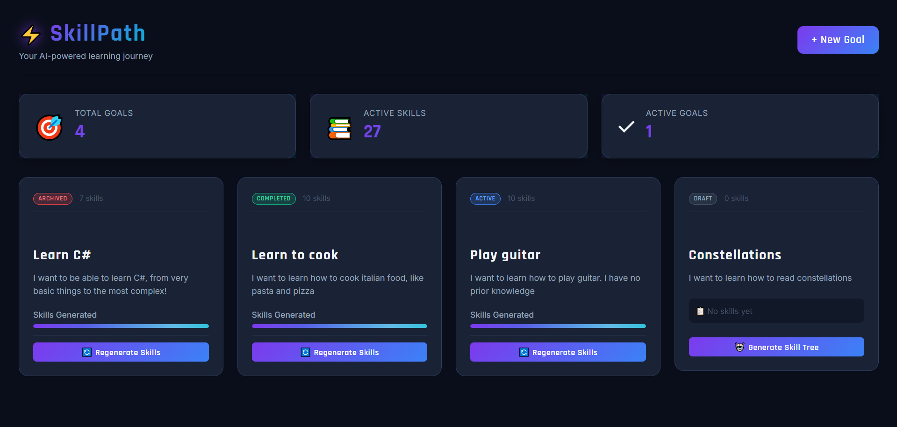
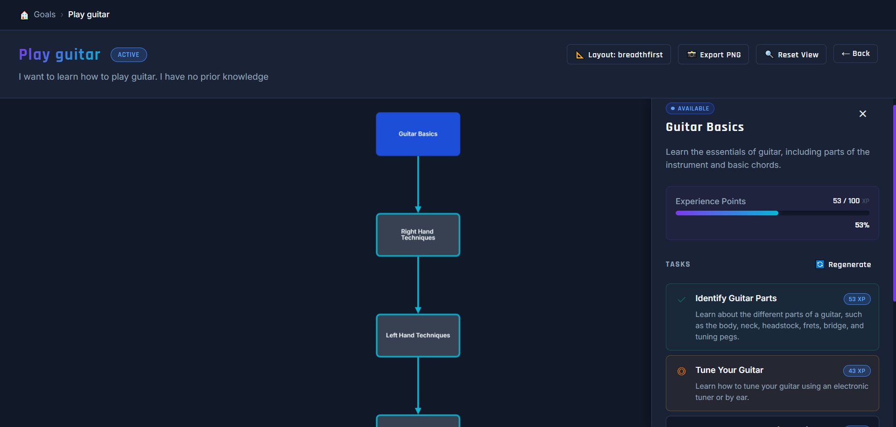
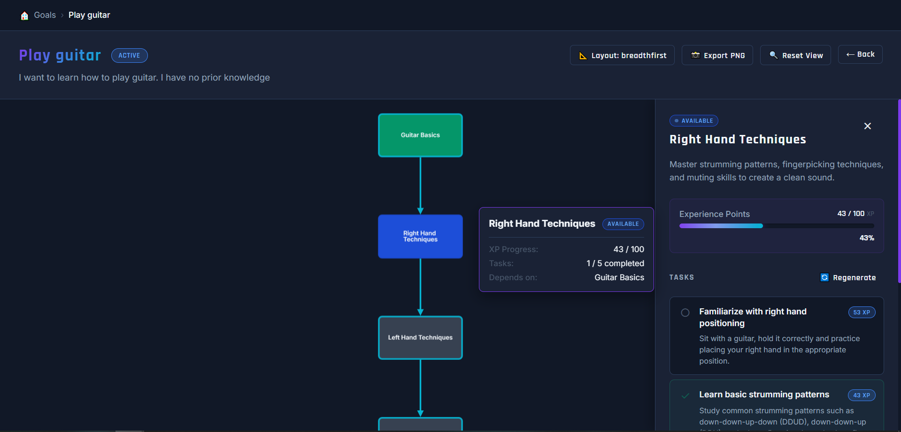

To be finished


[README.md](https://github.com/user-attachments/files/27455198/README.md)
# SkillPath 🎯

> AI-powered learning goal tracker that generates personalized skill trees and tracks your progress with gamified task management.


[Features](#features) • [Tech Stack](#tech-stack) • [Screenshots](#screenshots)

---

## 📋 Overview

SkillPath is a full-stack learning management application that uses AI to break down complex learning goals into structured skill trees with actionable tasks. Users can track their progress through an interactive visualization and earn experience points as they complete tasks.

### Key Highlights
- 🤖 **AI-Powered Generation**: Uses local Ollama LLM to generate customized skill trees and learning tasks
- 🎮 **Gamified Learning**: XP system with progress tracking and visual feedback
- 📊 **Interactive Visualization**: Multiple graph layouts (hierarchical, force-directed, grid) using Cytoscape.js
- 🎨 **Modern UI**: Clean, responsive interface built with Angular 21 and custom component library
- 🏗️ **Clean Architecture**: Follows DDD principles with CQRS pattern

---

## ✨ Features

### 🎯 Goal Management
- Create learning goals with title and description
- AI generates 5-12 skills based on difficulty level (Beginner/Intermediate/Advanced)
- Customize tree structure (Breadth/Depth/Balanced focus)
- Real-time generation progress tracking
- Delete goals with cascade deletion of skills and tasks

### 📚 Skill Tree Visualization
- **5 Layout Algorithms**: Breadthfirst, Hierarchical (Dagre), Force-Directed (COSE), Grid, Circle
- **Interactive Features**: 
  - Hover tooltips showing XP, task count, and dependencies
  - Click to highlight dependency chains
  - Smooth animated transitions between layouts
- **Export**: Download skill tree as high-resolution PNG
- **Status Tracking**: Visual indicators for Locked, Available, In Progress, Completed

### ✅ Task Management
- 5-7 AI-generated tasks per skill with weighted XP distribution
- Three-state task tracking: Not Started → In Progress → Completed
- XP progress bars with completion capping
- Regenerate tasks for any skill with one click
- Auto-unlock dependent skills upon completion

### 🎨 UI/UX Features
- Custom component library (Buttons, Cards, Badges, Modals, Progress Bars, Spinners)
- Toast notifications for user feedback
- Centralized error handling with user-friendly messages
- Loading states and progress indicators
- Responsive design (desktop and mobile)
- Dark theme with gradient accents

---

## 🛠️ Tech Stack

### Frontend
- **Framework**: Angular 21 (Standalone Components, Signals)
- **Language**: TypeScript 5.9
- **Visualization**: Cytoscape.js with Dagre & COSE-Bilkent layouts
- **Styling**: SCSS with CSS custom properties
- **State Management**: Angular Signals
- **HTTP**: RxJS with custom error interceptors

### Backend
- **Framework**: ASP.NET Core 8 Web API
- **Architecture**: Clean Architecture (Domain, Application, Infrastructure, API layers)
- **Pattern**: CQRS with Handler-based commands and queries
- **Database**: SQL Server with Entity Framework Core 8
- **AI Integration**: Local Ollama (Mistral model) via HttpClient
- **Validation**: Domain-driven validation with custom exceptions

### AI & Generation
- **Model**: Mistral (via Ollama)
- **Prompts**: Dynamic difficulty-aware system prompts
- **Retry Logic**: Automatic retry with JSON validation
- **Customization**: Temperature tuning based on difficulty level

---

## 📸 Screenshots

### Goals Dashboard

*Main dashboard showing learning goals with skill counts and generation status*

### AI Generation Settings

*Customize difficulty, tree structure, and skill count before generation*

### Skill Tree - Hierarchical Layout

*Interactive skill tree with hierarchical layout showing dependencies*

### Skill Tree - Force Directed Layout

*Physics-based force-directed layout for exploring skill relationships*

### Task Management Panel

*Task tracking with XP progress and regeneration options*

### Hover Tooltips

*Contextual information on hover showing XP, tasks, and dependencies*

---

## 🚀 Getting Started

### Prerequisites
- [.NET 8 SDK](https://dotnet.microsoft.com/download/dotnet/8.0)
- [Node.js](https://nodejs.org/) (v18+)
- [SQL Server](https://www.microsoft.com/sql-server) (LocalDB or Express)
- [Ollama](https://ollama.ai/) with Mistral model installed

### Installation

1. **Clone the repository**
   ```bash
   git clone https://github.com/yourusername/skillpath.git
   cd skillpath
   ```

2. **Setup Ollama**
   ```bash
   # Install Ollama from https://ollama.ai/
   ollama pull mistral
   ollama serve  # Runs on http://localhost:11434
   ```

3. **Backend Setup**
   ```bash
   cd SkillPath
   
   # Update connection string in appsettings.json if needed
   # Default: "Server=(localdb)\\MSSQLLocalDB;Database=SkillPathDb;Trusted_Connection=True"
   
   # Apply migrations
   dotnet ef database update --project SkillPath.Infrastructure
   
   # Run the API
   dotnet run
   # API runs on https://localhost:7015
   ```

4. **Frontend Setup**
   ```bash
   cd skillpath-ui
   
   # Install dependencies
   npm install
   
   # Run development server
   ng serve
   # App runs on http://localhost:4200
   ```

5. **Open the app**
   - Navigate to `http://localhost:4200`
   - Create your first learning goal
   - Watch AI generate a personalized skill tree!

---

## 🏗️ Architecture

### Backend Structure
```
SkillPath/
├── SkillPath.Domain/           # Entities, Value Objects, Enums
│   ├── Entities/               # Goal, Skill, LearningTask
│   └── Exceptions/             # DomainException
├── SkillPath.Application/      # Use Cases, DTOs, Abstractions
│   ├── Goals/Commands/         # CreateGoal, GenerateSkillTree, etc.
│   ├── Goals/Queries/          # GetGoalById, ListGoals
│   ├── Skills/Commands/        # RegenerateTasks, etc.
│   └── Abstractions/           # ISkillTreeGenerator, ITaskGenerator
├── SkillPath.Infrastructure/   # Data Access, AI Integration
│   ├── Persistence/            # EF Core, Repositories
│   └── AI/                     # OllamaSkillTreeGenerator
└── SkillPath.API/              # Controllers, Middleware
    ├── Controllers/            # GoalsController, SkillsController
    └── Middleware/             # ExceptionHandlingMiddleware
```

### Frontend Structure
```
skillpath-ui/src/app/
├── components/                 # Feature Components
│   ├── goals/                  # Goals dashboard
│   └── skill-tree/             # Interactive tree visualization
├── shared/components/          # Reusable UI Components
│   ├── button/
│   ├── card/
│   ├── badge/
│   ├── modal/
│   ├── spinner/
│   ├── progress-bar/
│   └── generation-settings-modal/
├── services/                   # Business Logic Services
│   ├── api.service.ts          # HTTP client
│   ├── error-handler.service.ts
│   ├── toast.service.ts
│   └── loading.service.ts
├── interceptors/               # HTTP Interceptors
│   └── error.interceptor.ts
└── models/                     # TypeScript interfaces
```

### Key Design Patterns
- **Clean Architecture**: Separation of concerns across layers
- **CQRS**: Command-Query Responsibility Segregation
- **Repository Pattern**: Data access abstraction
- **Unit of Work**: Transaction management
- **Dependency Injection**: Throughout both frontend and backend
- **Signal-based State**: Angular Signals for reactive UI
- **Error Boundary**: Global error handling with user feedback

---

## 🎓 What I Learned

Building SkillPath taught me:

### Backend
- ✅ Clean Architecture implementation in .NET
- ✅ Domain-Driven Design with rich domain models
- ✅ CQRS pattern for scalable command/query separation
- ✅ EF Core advanced features (value converters, cascade deletes)
- ✅ Integration with local LLM APIs (Ollama)
- ✅ Prompt engineering for consistent JSON generation
- ✅ Retry logic and error recovery for AI services

### Frontend
- ✅ Angular 21 standalone components and Signals
- ✅ Building a custom component library from scratch
- ✅ Complex graph visualization with Cytoscape.js
- ✅ RxJS operators and memory leak prevention
- ✅ Error interceptors and centralized error handling
- ✅ Toast notification system implementation
- ✅ Responsive design with SCSS and custom properties

### Full-Stack Integration
- ✅ RESTful API design and consumption
- ✅ CORS configuration for local development
- ✅ End-to-end error handling strategy
- ✅ Real-time progress tracking during async operations
- ✅ Optimistic UI updates with error rollback

---

## 🔮 Future Enhancements

- [ ] **User Authentication**: Multi-user support with Auth0/Identity
- [ ] **Cloud Deployment**: Deploy to Azure with managed SQL
- [ ] **Analytics Dashboard**: Track learning streaks and statistics
- [ ] **Goal Templates**: Pre-built skill trees for common topics
- [ ] **Export/Import**: JSON export for sharing goals
- [ ] **Mobile App**: React Native companion app
- [ ] **AI Model Options**: Support for multiple LLM providers
- [ ] **Collaborative Learning**: Share goals with friends
- [ ] **Spaced Repetition**: AI-suggested review tasks

---

## 📝 API Endpoints

### Goals
```
GET    /api/goals                    # List all goals
GET    /api/goals/{id}               # Get goal by ID
POST   /api/goals                    # Create goal
PUT    /api/goals/{id}               # Update goal
DELETE /api/goals/{id}               # Delete goal
POST   /api/goals/{id}/generate-skill-tree  # Generate skills
```

### Skills
```
GET    /api/goals/{goalId}/skills                        # List skills
GET    /api/goals/{goalId}/skills/{skillId}              # Get skill
POST   /api/goals/{goalId}/skills/{skillId}/regenerate-tasks  # Regenerate tasks
```

### Tasks
```
GET    /api/goals/{goalId}/skills/{skillId}/tasks        # List tasks
PATCH  /api/goals/{goalId}/skills/{skillId}/tasks/{taskId}/status  # Update status
```

---

## 🤝 Contributing

This is a portfolio project, but feedback and suggestions are welcome! Feel free to:
- Open an issue for bugs or feature requests
- Submit a pull request with improvements
- Share your experience using SkillPath

---

## 📄 License

This project is licensed under the MIT License - see the [LICENSE](LICENSE) file for details.

---

## 👨‍💻 Author

**Duarte [Your Last Name]**
- GitHub: [@yourusername](https://github.com/yourusername)
- LinkedIn: [Your LinkedIn](https://linkedin.com/in/yourprofile)
- Portfolio: [yourportfolio.com](https://yourportfolio.com)

---

## 🙏 Acknowledgments

- [Ollama](https://ollama.ai/) for local LLM infrastructure
- [Cytoscape.js](https://js.cytoscape.org/) for graph visualization
- [Angular](https://angular.dev/) for the amazing framework
- [ASP.NET Core](https://dotnet.microsoft.com/apps/aspnet) for robust backend capabilities

---

<div align="center">
  <sub>Built with ❤️ as a learning journey through full-stack development</sub>
</div>
